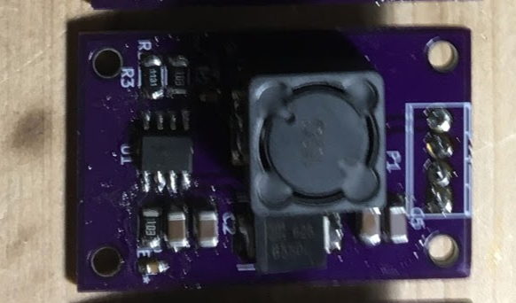
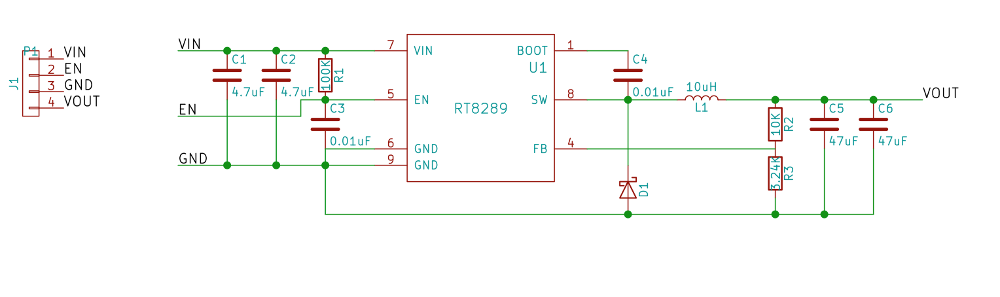

# A small voltage regulator on a board

This was designed around March 2017.

This is basically from their datasheet.

Using a switch mode buck converter IC, can use resistors to get different voltages output.  I built 2 kinds of this module, one for 5V and one for 12V. To control the voltage you just use different resistors to set up the voltage reference.

The datasheet sais this is rated up to 5A.

Total BOM including the printed circuit board is perhaps $20.
